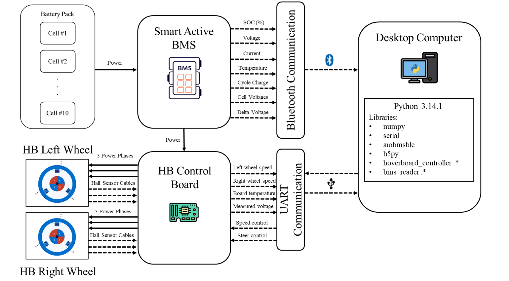

# ev-bms-data-acquisition
This repository contains the scripts and tools used to collect synchronized telemetry data from an electric mobility platform that includes both a hoverboard controller and a BMS (Battery Management System).

# Experimental Setup and Data Collection

## Battery Pack and Battery Management System (BMS)

The experimental platform is built around a **lithium-ion battery pack** composed of ten lithium-ion cells, resulting in a **nominal pack voltage of 42 V** and a **total capacity of 10.2 Ah**. The pack is interfaced with a **smart active Daly BMS** (60 A rating), which provides:

- Active cell balancing  
- Monitoring and protection functionalities  

The BMS sends real-time data, including:

- Cell-level voltage measurements  
- Pack voltage and current sensing  
- State-of-Charge (SoC)  

Communication with the BMS is established **wirelessly via Bluetooth**, allowing the data acquisition system to retrieve real-time measurements.

---

## Load System: Hoverboard

A commercially available **hoverboard** is used as the electrical load. The hoverboard controller has been modified with **custom firmware** from this [repo](https://github.com/EFeru/hoverboard-firmware-hack-FOC) to enable sending speed and control commands to the hoverboard and receiving real-time feedback signals.

The hoverboard controller communicates with the **PC-based data collection system** via a **USART interface**. A **TTL-to-USB converter** bridges the controller’s serial interface with the PC’s USB port.  

The hoverboard wheels are driven by **brushless DC (BLDC) motors** with:

- Three-phase power windings for actuation  
- Integrated Hall-effect sensors for rotor position feedback  

> At this stage, hoverboard wheels rotate freely without mechanical load. Future experiments will introduce a controlled mechanical load to emulate real-world conditions.

---

## Data Acquisition and Control Platform

The **central element** of the data acquisition system is a **PC**, which performs the following roles:

1. Acts as the **main controller**, issuing speed commands to the hoverboard controller via USART.  
2. **Collects feedback data** from the hoverboard controller.  
3. Establishes and maintains a **BLE connection with the BMS** to periodically log battery parameters.  
4. **Time-synchronizes and stores** all acquired data in a single HDF5 file for analysis.

---

## Experimental Procedure

The experiments are designed to capture battery and system behavior across a range of operating conditions.  

### Test Scenarios:

1. **Discharge experiments**: From 100% SoC down to 50% SoC at full speed and several reduced speed setpoints (percentages of maximum speed).  
2. **Charge experiments**: From 50% SoC up to 100% SoC, logging the same battery parameters via the BMS.  

Each experiment is executed as a **controlled run**, with all relevant electrical and control signals continuously recorded.  

- **Sampling rate**: 1 Hz  
- **Observation**: Limited variation between consecutive samples due to slow battery dynamics  
- **Post-processing**: Data is downsampled to reduce redundancy, while original raw data is preserved.

---

## Drivers

The `drivers` folder contains Python modules for interfacing with the battery system and the hoverboard load.

### 1. BMS Reader (`bms_reader.py`)

`BMSReader` is a Python class for **real-time monitoring of a Daly BMS** via Bluetooth Low Energy (BLE). 

- Connects to a specific BMS device by name.
- Continuously reads cell-level and pack-level parameters such as:
  - Voltage, current, and SoC
  - Temperature sensors and values
  - Cycle count and capacity
  - Cell voltages and delta voltages
- Provides thread-safe access to the latest sample.
- Uses asynchronous BLE communication for efficient real-time data acquisition.

### 2. Hoverboard Controller (`hoverboard_controller.py`)

`HoverboardController` is a Python class for **serial communication and control of a modified hoverboard**.

- Connects to the hoverboard via a serial port (TTL-to-USB bridge).
- Sends speed and steering commands using the hoverboard's custom protocol.
- Reads real-time feedback including wheel speeds, battery voltage, and board temperature.
- Supports smooth speed ramping and thread-safe access to control and feedback data.
- Provides optional real-time printing of feedback for monitoring.
- Uses multi-threading to handle sending commands, receiving feedback, and optional logging simultaneously.
